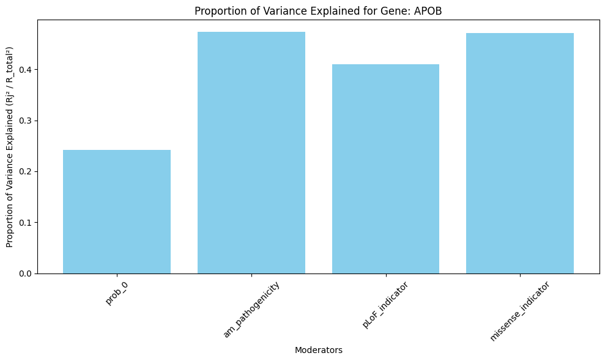
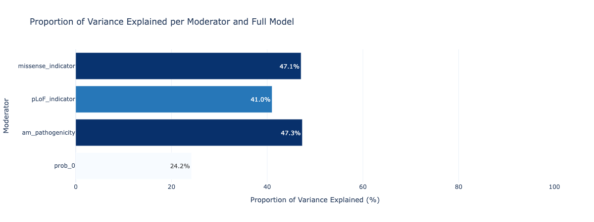

# **Meta-Regression Visualization Package for Rare Variant Association Studies**

## **Overview**

This Python package provides tools for computing and visualizing the proportion of variance explained by different moderators in a **meta-regression model**. The package is designed for **Rare Variant Association Studies (RVAS)**, incorporating **genetic variant effect sizes**, **moderator variables**, and **statistical model fitting**.

## **Features**

- Compute **weighted sum of squares (SST, SSR\_full, SSR\_reduced)**.
- Calculate **proportion of variance explained** for each moderator.
- Generate **bar plots** for variance contributions of moderators.

## **Installation**

You can install the package locally with:

```bash
pip install -e .
```

or

```bash
pip install path/umr-visualizer
```

## **Usage**

### **1. Importing the Package**

```python
import umr_visualizer as uv
```

### **2. Example Input Table**

Your dataset should be structured as follows:

| Gene  | Variant ID | Beta | SE Beta | Mod\_1 | Mod\_2 | Mod\_3 | ... |
| ----- | ---------- | ---- | ------- | ------ | ------ | ------ | --- |
| Gene1 | G1         | 0.2  | 0.1     | 1.2    | 0.5    | 1.0   | ... |
| Gene1 | G2         | -0.5  | 0.2    | 0.8    | 0.3    | 0.7    | ... |
| Gene2 | G3         | 1.3  | 0.15     | 1.1    | 0.6    | 0.8    | ... |
| Gene2 | G4         | 0.7  | 0.05    | 0.9    | 0.4    | 0.9   | ... |


**Application** : The dataset is now filtered specifically for the ABOP gene across all files from the directory:
/scratch/groups/mrivas/larissaredo/prepped_files .  Additional details on the dataset size and preprocessing could be found on from test_package.ipynb


### **3. Compute Proportions**

```python
# Define moderators
moderators = ["Mod_1", "Mod_2", "Mod_3"]
```
# Compute proportions of variance explained example per moderator for a collection of genes
prop_red = uv.proportion_variance_explained_per_gene(df, fitted_values_full,"Mod1", ['Gene1', 'Gene2'])


### **4. Plot Proportions explained for a list genes**

```python
uv.plot_proportion_variance_explained(df, fitted_values_full,"matplotlib" , ['Gene1', 'Gene2'])
```


```python
uv.plot_proportion_variance_explained(df, fitted_values_full,"seaborn" , ['Gene1', 'Gene2'])
```


<!-- ```python
uv.sns2_proportion_variance_explained(df, fitted_values_full)
```
<<<<<<< HEAD
 -->
=======

>>>>>>> 244ec3678439450012011896520d9ea97897db30

```python
uv.plot_proportion_variance_explained(df, fitted_values_full,"plotly" , ['Gene1', 'Gene2'])
```



## **Methods & Equations**

The package follows the **meta-regression framework**:

1. **Weighted Mean**

   $$\bar{y}_w = \frac{\sum w_i y_i}{\sum w_i}$$

   where
    $$w_i = \frac{1}{SE_{\beta_i}^2}$$.

3. **Total Sum of Squares (SST)**


   $$SST = \sum w_i (y_i - \bar{y}_w)^2
   $$

4. **Sum of Squared Residuals (SSR\_full & SSR\_reduced)**

   $$SSR_{\text{full}} = \sum w_i (y_i - \hat{y}_i)^2
   $$

   $$SSR_{\text{reduced}, j} = \sum w_i (y_i - \hat{y}_i^{\text{reduced}})^2
   $$

5. **Proportion of Variance Explained**

   $$Proportion_j = \frac{R^2_j}{R^2_{\text{total}}}
   $$

   with

   $$R^2_j = \frac{SSR_{\text{reduced}, j} - SSR_{\text{full}}}{SSR_{\text{reduced}, j}}
   $$

## **Directory Structure**

```
meta_regression_viz/

│
├── images/
│   ├── output.png         # Image examples 
├── meta_regression_viz/
│   ├── __init__.py         # Package initializer
│   ├── stats.py            # Functions for computing SST, SSR, and proportions
│   ├── plots.py            # Functions for plotting variance explained
│
├── setup.py                # Installation script
├── README.md               # Documentation
├── LICENSE                 # License file
├── requirements.txt        # List of dependencies
├── test_package.ipynb       # Example Update
└── .gitignore              # Ignore unnecessary files
```

## **License**

This package is licensed under the **MIT License**.

## **Authors**

- **Salma Zainana**
- **[szainana@stanford.edu](mailto\:szainana@stanford.edu)**
  +++

